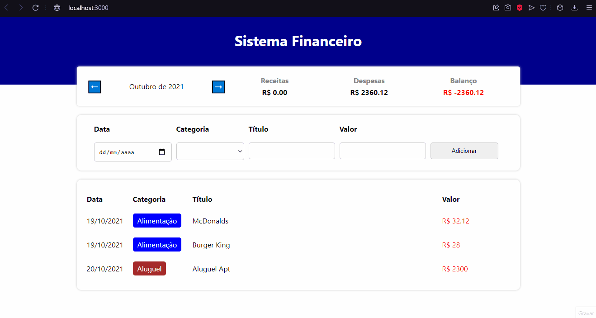

<h1>App para Finanças Pessoais</h1>

<h2>Sobre</h2>

<p>Aplicativo feito para controle das suas finanças mensais. Os valores são filtrados de acordo com o mês que </br>
o gasto foi feito. Filtrado por receitas e despesas, com a sua média calculada (se você está no lucro no mês) </br>
ou no negativo. Caso queira, você pode adicionar alguma receita ou despesa, e o valor da média será recalculado automaticamente
</p>

### Features
- [x] Inserir novos gastos
- [x] Média mensal
- [x] Valores filtrados mensalmente
- [x] Adicionar um novo item

<h1>
    
</h1>

### Pré-requisitos
Antes de começar, você vai precisar das seguintes ferramentas: [Git](https://git-scm.com), [Node.js](https://nodejs.org/en/) e um editor de código, como o [VSCode](https://code.visualstudio.com/)

### Rodando o projeto
```bash
# Clone este repositório
git clone https://github.com/MalcolmMello/PersonalFinances

# Acesse a pasta do projeto pelo seu terminal
cd PersonalFinances

# Instale as dependências
npm install

# Inicie a aplicação
npm start

# O servidor irá rodar na porta:3000 - acesse <http://localhost:3000>

```

### Tecnologias
- React
- Typescript
- Styled-components

---

Feito no desafio 5 projetos em 5 dias pela B7Web - [Meu LinkedIn](https://www.linkedin.com/in/malcolm-de-mello-a8208a224/)
